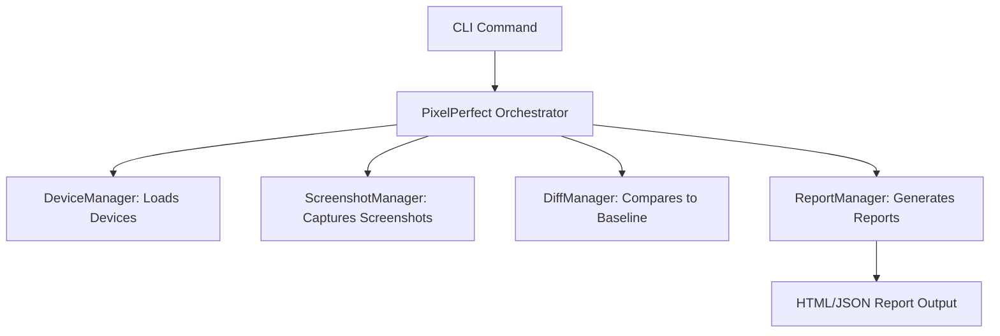

# Pixel Perfect

Automated Responsive Testing Platform

---

Pixel Perfect is a CLI tool for automated responsive visual regression testing. It captures website screenshots across multiple devices, compares them to baselines, and generates detailed HTML/JSON reports highlighting layout shifts, broken UI, and inconsistencies.

## Features

- Multi-device, multi-viewport screenshot capture
- Visual diffing against baselines
- Baseline management
- Modern HTML and JSON reports
- Extensible, modular TypeScript codebase

## How It Works (Flow)



1. **CLI**: You run a command like `pixel-perfect test --url https://example.com`.
2. **PixelPerfect Orchestrator**: Coordinates the test run.
3. **DeviceManager**: Loads device presets/configs.
4. **ScreenshotManager**: Uses Playwright to capture screenshots for each device.
5. **DiffManager**: Compares screenshots to baselines using pixelmatch/sharp.
6. **ReportManager**: Generates HTML and JSON reports summarizing results.

## Installation

```sh
npm install -g pixel-perfect
# or clone and run locally:
git clone <repo-url>
cd pixel-perfect
npm install
npm run build
```

## Usage

### Run Responsive Tests

```sh
pixel-perfect test --url https://example.com \
  --devices "iPhone 12,iPad Pro,Desktop" \
  --output ./screenshots \
  --threshold 0.1
```

- `--url` (required): The URL to test
- `--devices`: Comma-separated device names (default: iPhone 12,iPad Pro,Desktop)
- `--output`: Output directory for screenshots/reports (default: ./screenshots)
- `--threshold`: Pixel match threshold (default: 0.1)

### Update Baseline Screenshots

```sh
pixel-perfect update-baseline --url https://example.com --output ./screenshots
```

## Output

- Screenshots and baselines are saved in the output directory.
- Reports are generated in `output/reports/` as HTML and JSON files.

## Extending

- Add new devices in the CLI or via config.
- Extend core managers for custom flows.

## Project Structure

- `src/core/` – Main managers (Device, Screenshot, Diff, Report)
- `src/types/` – TypeScript interfaces
- `src/utils/` – Utilities (Logger, etc.)
- `src/cli.ts` – CLI entry point

---

For more, see inline JSDoc comments in the codebase.

## License

MIT
